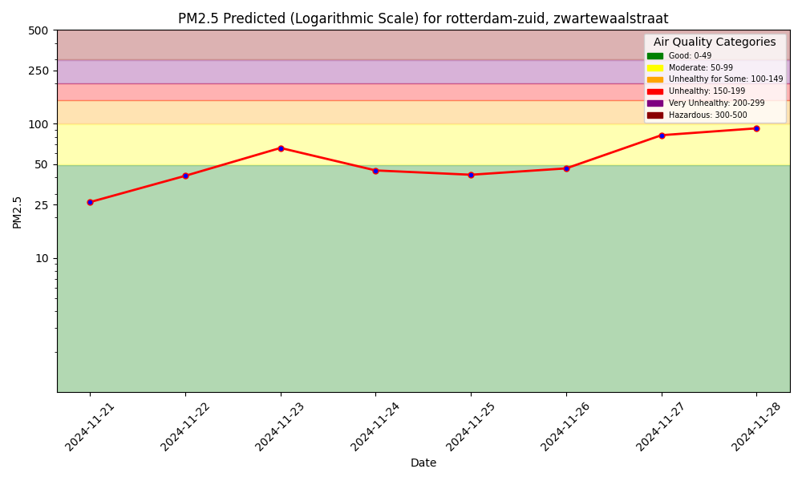

# ID2223-Scalable-Machine-Learning

This assignment implements a air quality prediction service for the centre of Rotterdam using publicly available sensor and weather data using https://aqicn.org/api/ and https://open-meteo.com/. Using [Hopsworks](https://app.hopsworks.ai) to orchestrate and manage feature groups and prediction models. A Extreme boosted gradient model is used for predictions. The first image shows the predicted air quality for the next 7 days ([see image one](air_quality_prediction_service/ch03/docs/air_quality_model/assets/images/pm25_forecast.png)). The second image shows the predicted air quality with the actual air quality observed that day ([see image two](air_quality_prediction_service/ch03/docs/air_quality_model/assets/images/pm25_hindcast.png)).

# Location

Zwartewaalstraat is located in the south of Rotterdam (Charlois district), close to the city center, the Maas River, and the famous Erasmus Bridge. Rotterdam is known for its large international port and industrial district. Large companies such as Royal Dutch Shell occupy significant land mass close to civilian neighborhoods. National efforts have been made for many decades (since the 1960s) to monitor air quality in this region due to the exposure.

# Forecast

# Hindcast

