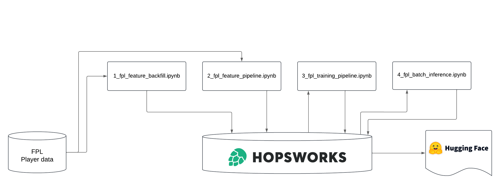

# ID2223 - Scalable Machine Learning

## Introduction
The goal of this project is to predict the points that Fantasy Premier League (FPL) players will score in the upcoming game week. This will help FPL managers make informed decisions about transfers, captaincy, and team selection. The data sources include the Fantasy Premier League’s official API, which provides player statistics, fixture data, and historical performance metrics. The model is built using a backfill of all the data in a season and utilizes current live data to predict points.

## Problem Description
Predicting player performance, both in real-life and fantasy scenarios, is highly beneficial. As of the 2024 season, the estimated value of the first-place prize in FPL is approximately €13,500. The world of football is increasingly adopting artificial intelligence, with more than a billion euros being invested in developing home-grown talent. Predictive services are becoming essential.

The biggest challenge when predicting player performance is the inherent uncertainty in professional sports. Player performance can vary dramatically due to injuries, confidence, personal challenges, and more. In an ideal world, a prediction model would incorporate data from multiple sources to create a comprehensive context for player performance. While this is a school project with limited time and resources, we aim to achieve the most accurate predictions possible within these constraints.

## Tools
This project is implemented in Python, leveraging PyTorch, Scikit-learn, and pandas for data processing and feature engineering. Hopsworks is used for storing features and predictions. For deployment, we use [Hugging Face Spaces](https://huggingface.co/spaces/ID2223JR/fpl_app).

## Data
The data for this project is fetched from the [Fantasy Premier League API](https://fantasy.premierleague.com/api). This API provides information about players, teams, and matches in the English Premier League. The dataset is updated daily and contains metrics such as goals scored, assists, clean sheets, and other performance indicators. These metrics are used to predict the points players will receive in a game week. Points are determined by various actions, such as playtime, goals (differentiated by position), avoiding penalties, and more. Negative points can also be awarded for yellow or red cards.

Additionally, a static dataset provides supplementary information such as team names and player positions. This dataset is not part of the prediction pipeline but aids in feature interpretation.

## Methodology and Algorithm
The pipeline structure is inspired by the first lab assignment, which involved a serverless ML pipeline to predict air quality values. While the project structure is similar, the implementation diverges significantly.

### 1. Backfill
The historical data used to train the model is cleaned and prepared for storage in Hopsworks as feature groups. This notebook is run once to create an up-to-date backlog. Future measurements are processed and stored daily. A crucial aspect of feature engineering is shifting the data by one week, which enables predictions.

### 2. Feature Pipeline
This notebook updates the dataset daily using GitHub Actions. API keys created during the backfill process are retrieved from Hopsworks and used to fetch the latest data from our sources, updating the feature groups accordingly.

### 3. Training Pipeline
Once the datastore is ready, we build the prediction model. A Hopsworks Feature View is created, and the data is split into training and testing sets. We use Extreme Gradient Boosting (XGBoost), a fast and flexible model well-suited for achieving high predictive accuracy. The trained model is then stored in Hopsworks for later use.

### 4. Batch Inference
Finally, the trained model and prepared data are used to make predictions for the next game week. Predictions are updated for the latest game week by incorporating the actual points scored by players.

## Results
The user interface for this project is hosted on [Hugging Face Spaces](https://huggingface.co/spaces/ID2223JR/fpl_app). It displays all active players, their predicted scores, and their historical scores for comparison. Interestingly, some players receive negative points due to fouls, which is accurately reflected in the predictions.

When comparing the top-rated players predicted by our model with other sources such as the [Premier League Official Site](https://www.premierleague.com/stats/top/players) or [Goal.com](https://www.goal.com/en/lists/premier-league-player-of-the-season-2024-25-power-rankings/blt350cdd828461eaeb), we observe significant similarities.

### Model Evaluation
The final model achieved the following metrics:
- **Mean Squared Error (MSE):** 6.15
- **Root Mean Squared Error (RMSE):** 2.48
- **R-Squared (ℓ²):** 0.093

An RMSE of 2.48 indicates that predictions will generally fall within 2.48 points of the actual score. Most player points range between -1 and 18, suggesting that the model captures general trends but struggles with finer distinctions among players of similar caliber.

The R-squared value of 0.093 indicates that approximately 9% of the variability in player points is explained by the model, while 91% is due to external factors not captured in the dataset. This underscores the limitations of the features used in the model.

## Discussion
Predicting player points involves numerous variables, many of which are not included in the dataset. Factors such as injuries, opponent strength, and match context significantly influence performance but are not represented in the provided data.

Our model performs reasonably well given the available data. Improvements would require additional features and more robust datasets. For example, FPL assigns points differently based on player positions (e.g., strikers receive fewer points for goals than defenders). This positional context is not explicitly captured in our data, leading to a more generalized model.

Future enhancements could include experimenting with more advanced models such as LightGBM, CatBoost, or neural networks. However, time constraints prevented their implementation in this project.

## Conclusion
This project provided valuable insights into building predictive systems. We learned that achieving high accuracy requires extensive and diverse data. While using Hopsworks offered many advantages, it also presented challenges when issues arose.

For future work, we recommend testing additional models and incorporating more data sources to enrich the feature set. There is significant potential for refining the existing pipeline to achieve better results.